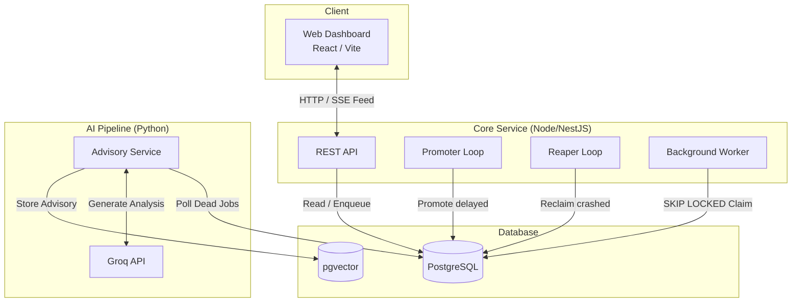
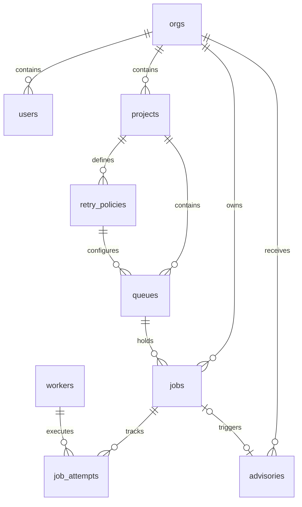

# Ballast

Ballast is a distributed, exactly-once job scheduler built on top of PostgreSQL and NestJS. It provides robust, resilient, and deterministic background job processing.

## Architecture

Ballast consists of three main components:
1. **Core (`core/`)**: The main NestJS backend. It exposes the REST API for enqueuing jobs, inspecting queues, and managing workers. It also embeds the background processes (the Promoter and the Reaper) that maintain the job state machine. When started with `RUN_WORKER=true`, it spins up an integrated worker in the same process.
2. **AI Advisory Pipeline (`ai/`)**: An asynchronous Python FastAPI service that watches the database for failed jobs and uses the Groq API to automatically generate root-cause analysis advisories for developers.
3. **Web Dashboard (`web/`)**: A React (Vite) frontend application that provides real-time visibility into the fleet, queue statistics, job traces, and generated advisories.

### Architecture Diagram



## Database Schema (ER Diagram)

The system relies on a strictly normalized relational database to maintain scheduling invariants without relying on distributed transactions.



## The Job State Machine & Exactly-Once Guarantees

Jobs in Ballast transition through a strict state machine to guarantee exactly-once processing (or at-most-N retries):

1. **`scheduled`**: Jobs with a future `available_at` timestamp.
2. **`ready`**: Jobs ready to be executed.
3. **`running`**: Jobs actively claimed by a worker. A short lease (`lease_expires_at`) prevents deadlocks if a worker crashes.
4. **`completed`**: Jobs that finished successfully.
5. **`failed`**: Jobs that threw an error, with remaining attempts. They transition back to `scheduled` using an exponential backoff policy.
6. **`dead`**: Jobs that exhausted all their retries (dead-letter queue).

### Invariants

- **Concurrency**: `SKIP LOCKED` ensures two workers can never claim the same job.
- **Resilience**: The Reaper periodically scans for `running` jobs whose `lease_expires_at` has passed. It safely returns them to `ready`, ensuring a hard crash (e.g., `kill -9`) never drops a job.
- **Idempotency**: Retries create new `job_attempts` rows, preserving the full execution history without mutating past failures.

## Design Decisions & Trade-offs

1. **PostgreSQL over Redis/RabbitMQ**: 
   By keeping jobs in PostgreSQL alongside application data, we eliminate distributed transactions, simplify the operational stack, and achieve strict consistency. Using `SELECT ... FOR UPDATE SKIP LOCKED` allows highly concurrent, contention-free queue processing comparable to dedicated brokers.
2. **In-process Worker vs. Standalone**: 
   While Ballast supports horizontally scaling standalone workers across a fleet, bundling a worker inside the Core API process (`RUN_WORKER=true`) allows the entire scheduling tier to run on a single cloud instance. This lowers the barrier to entry while retaining the ability to scale out seamlessly later.
3. **AI on the Cold Path**: 
   The LLM advisory loop runs as a separate, asynchronous Python worker polling for dead-lettered jobs. This ensures that slow LLM inference latency or API outages never impact the hot execution path of the job scheduler.
4. **pgvector Deduplication**: 
   To prevent alert fatigue from noisy or flaking jobs, the AI service embeds failure signatures into vectors and drops near-duplicate advisories, ensuring operators only see novel failures.

## API Documentation

The Core service exposes the following major REST endpoints:

- **Authentication:**
  - `POST /api/v1/auth/login`: Issue JWT access & refresh tokens.
  - `GET /api/v1/me`: Fetch current user and org context.
- **Jobs:**
  - `POST /api/v1/jobs`: Enqueue a new job payload to a specific queue.
  - `GET /api/v1/jobs`: List, filter, and paginate jobs.
  - `GET /api/v1/jobs/:id/attempts`: Retrieve the execution trace of a specific job.
  - `POST /api/v1/jobs/:id/retry`: Manually retry a dead-lettered job.
- **Advisories & Live Feed:**
  - `GET /api/v1/advisories`: Fetch AI-generated insights for the organization.
  - `POST /api/v1/advisories/:id/ack`: Acknowledge and dismiss an advisory.
  - `GET /api/v1/live/feed`: Connect to the Server-Sent Events (SSE) stream for real-time dashboard updates.

## Local Development

### 1. Database
Ballast requires PostgreSQL. A Supabase connection string is recommended.

```bash
cd core
# Duplicate .env.example to .env and set your DATABASE_URL
npm install
npm run db:migrate
npm run db:seed-demo
```

The seed script provisions a demo account (`demo@ballast.dev` / `ballast-demo`).

### 2. Start Core
```bash
cd core
RUN_WORKER=true npm run start:dev
```
_Note: If using `tsx` (start:dev), ensure explicit `@Inject` decorators are used, or compile with `tsc` and run the `dist` output._

### 3. Start AI Pipeline (Optional)
```bash
cd ai
# Duplicate .env.example to .env and set DATABASE_URL and GROQ_API_KEY
python3 -m venv venv
source venv/bin/activate
pip install -r requirements.txt
uvicorn app.main:app --reload
```

### 4. Start Dashboard
```bash
cd web
npm install
npm run dev
```
Navigate to `http://localhost:5173`.

## Deployment
See [deploy/README.md](deploy/README.md) for zero-downtime deployment instructions to Render.
